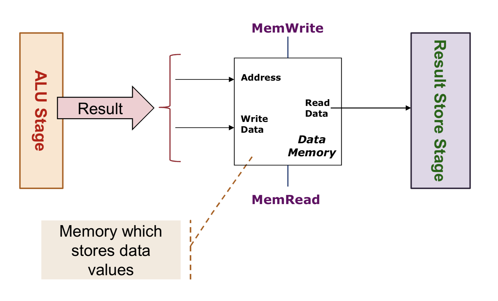
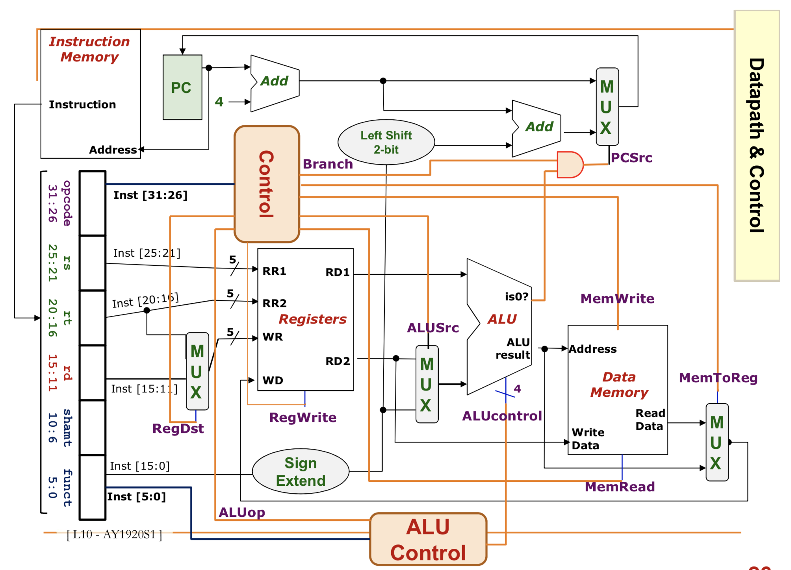

# CS2100 (AY19/20 Sem 1) Revision Notes for Mid Term
#### Prepared by Raivat Shah 

## Lecture 2 - Overview of C

At the lowest level, hardwre components work on 2 states: On(1) & Off(0)/ So data & instructions must be in binary. 

**Different Languages**

Natural Language (Easiest to express) &rarr; High-Level Language (eg C/Python) &rarr; Assembly Language (eg MIPS) &rarr; Machine Code (eg 0xAAAABBBB, closest to hardware)

**Translater**

Source Lang &rarr; Translater &rarr; Target Lang

If Source Lang = High-level lang, Translator = Compiler. 

**Life of a Program**

*Compiled*: Editor &rarr; Compiler &rarr; Assembler &rarr; Linker &rarr; OS
Entire prog compiled before executation into an executable. Just in Case execution. Eg for C/C++/Swift

*Interpreted*: Editor &rarr; Interpretor
Compilation on the "fly." Executed statement by statement at Run Time. Just-in-Time execution. Eg for Python/JS. 

*On a Virtual Machine*: Editor &rarr; Compiler &rarr; VM &rarr; OS
Same as *Compiled* but compiled into an intermediate executable that runs on a VM. 

### The C Language - We follow ANSI C (C90)

General Purpose PL developed in 1972 by Dennis Richie for use with UNIX Operating System. Provides only a min core mechanism. Exposes underlying machine model while still being portable. Assumes Programmer Knows best. Procedural in Nature. Very efficient in execution speed and memory footprint. 

Sample C program:

```c
#include <stdio.h>

int main()
{
    printf("Hello World\n");
    return 0;
}
```
Notes:

1. All code resides within a function. So a `.c` program is just a bunch of funcs.
2. Program starting point is always the `main` function, which always returns `0`.
3. `#include<stdio.h>` is a pre-processor directive. Means add the file `stdio.h` for compilation. Now can use code from that file, eg `printf`. Can define global constants using `#` also. 
4. C is case sensitive and a statement is equivalent to a step in an algorithm. 

**C Variables**

* Each variable is stored in the memory (RAM), a long 1D array. 
* Must be declared before use & data type specified at declaration. Data type decides type of value, size of value (no of bytes), & range of values (depends upon size)
* Do not have an initial value.

| Data Type     |  32-bit processor | 64-bit processor  |
| ------------- |:-------------:| -----:|
| `int`     | 4 bytes | 8 bytes |
| `float`    | 4 bytes     |   8 bytes |
| `double` | 8 bytes      |    16 bytes |
| `char` | 1 byte     |   1 byte |

*Note* 1 `byte` = 8 `bits`. 1 `byte` can represent upto 2^numBits - 1 = 2^8 -1 = 255in base 10. So, for 4 byte `int`, the range is from [-2^31 to 2^31 - 1]. 

Range Limitation:  
```c
#include <stdio.h>

int main()
{
    int i = 2147483647; //2^31 - 1. Max possible value for int in c. 
    while(i > 0) {
        printf("%d", &i); //output will be 2147483647.
        i++;
    } // loop will only run once.

    printf("%d", &i); //output will be -2147483647. 
}
```
After hitting the maximum number, C variables will "go back" to the 0, something like a clock or the `modulo` operator in math. Note that need to *dereference* variable with a pointer to refer to it.

Accuracy Limitation: 

**C Type Conversion**

*Hierarchy* `char` &rarr; `int` &rarr; `float` &rarr; `double`

Widening: going to right from left. No loss of information. Eg 1 to 1.00 

Narrowing: going to left from right. Loss of info. Eg 1.7 to 1. 

Implicit: Performed automatically based on defined rules. 

Explicit: Programmer decides data type change. 

*Rules for Implicit Conversion*

Consider `A op B &rarr; C` (Arithmetic)

* if A and B same type, then C also same type. Eg 5 + 6 = 11, 5 / 2 = 2
* Else, lower data type promoted to higher (widening) and C is of the higher data type. Eg 3.0 * 4 = 12.0, 5 / 2.0 = 2.5. 

Consider `A = B` (Assignment)

B will be widened/narrowed based on data type of A. Think of this as `B` going into `A` so it must abide by `A`'s rules. 

*Explicit Casting*

Use (`data type`) + variable to convert explicitly. Eg (`double`) 2 &rarr; 2.0

## Lecture 3 - Data Representation & Number Systems

**Different bases and conversions**

Base 10 is only a way of representing powers of 10. Eg: 2915 = 5 x 10^0 + 1 x 10^1 + 9 x 10^2 + 2 x 10^3. 

We can have different bases too: 

Base 10 &rarr; Denary, Base 2 &rarr; Binary, Base 8 &rarr; Octal, Base 16 &rarr; Hexadecimal. 

*Converting base R to base 10:*

(572) base 8 = 2 x 8^0 + 7 x 8^1 + 5 x 8^2  = 378 base 10. 

For simple arithmetic in base R, use upto max digit allowed and then carry. Eg:

0b10 + 0b11 = 0b101 = 5 (base 10). (As 1+1 = 2 but 2 is not a digit in binary, carry the one over.)

*Converting base 10 to base R:*

Repeated division by powers of R less than the number in base 10 until remainder is 0. Eg

(89) base 10 to binary:

89 / 64 = 1 remainder 25
25 / 32 = 0 remainder 25 
25 / 16 = 1 remainder 9
9 / 8   = 1 remainder 1
1 / 4   = 0 remainder 1
1 / 2   = 0 remainder 1
1 / 1   = 1 remainder 0

Therefore, (89) base 10 = (1011001) base 2. 

*Base K to Base J*, use 10 as a "bridge." Shortcut exists between base 2 to base 8/base 16. 

For Base 2 and Base 8: 
Every 3 digits of binary represent 1 digit of Octoal. Eg Binary 111 is Octal 7. Binary (00)1000001 in Binary is 101 in Octal. In general, group bits of Binary into triplets for the conversion. 

For Base 2 and Base 16:
Every 4 digits of binary represent 1 digit of Hexadecimal. Eg Binary 1111 is Hexadecimal F (15). Binary (0)1000001 in Binary is 41 in Hexadecimal. In general, group bits of Binary into quadruplets for the conversion. 

**Data Representation on Computers** 

All info (image, video, application, etc) on a computer is stored as binary values. 

Common Storage Units:
* Bit (Binary Digit) is a single 0 or 1.
* Byte - 1 Byte = 8 bits. (Usually smallest accessible unit)
* Word - 4 bytes/8 bytes (platform dependent). Double/Half world also possible. 

N bits can represent upto 2^N different values eg 2 bits can represent 2^2 = 4, 3 bits can represent 2^3 = 8, and so on...

To represent M values, need Math.Ceil(log base 2 of M)

Data Types in Programming Languages Map to Underlying Storage Units. We explore their representation using limited bits. 

**Integers**

Unsigned Numbers - Only non-negative values. Easily represented using simple binary digits.

Signed Numbers - Negative & Positive values. Need a representation. 

##### Common Representations 

#### Sign-and-Magnitude

Sign represented by a 'sign-bit' - the most significant bit. 0 for positive, 1 for negative. 

| sign |   | digit | | digit | | digit | | digit | | digit | | digit | | digit |

Representation range from -127 to 127 (inclusive in base 10)

For n-bit sign-and-magnitude representation, range of values is [-2^n-1, 2^n-1]. Only one zero. 

Sign-and-magnitude not very good with arithmetic operations. 

#### Complements

Complements are very good for subtraction and logical manipulations. 

In *1s complement*, positive num X of binary stays X. However, -X becomes $$2^n - X - 1$$. To calculate, invert all bits. MSB indicates sign 

For n-bit 1s complement, range is [-2^n-1, 2^n-1]. There are 2 zeros (positive & negative). 

For addition: `A + B`. Perform binary addition. If carry of MSB, add 1 to the result. Check for overflow (when sign of A & B is opposite)

For subtraction: `A - B = A + (-B)`. Take 1s complement of B and add that to A.  

In *2s complement*, positive num X of binary stays X. However, -X becomes 2^n - X. To calculate, invert all bits (1s complement) and add 1 to the result. MSB indicates sign.

For n-bit 2s complement, range of values is [-2^n-1, 2^n-1]. Only one zero. 

For addition: `A + B`. Perform binary addition. Ignore carry of MSB. Check for overflow (when carry in is not equal to carry out or when signs are different)

For subtraction: `A - B = A + (-B)`. Take 2s complement of B and add that to A.  

Can extend idea of complement to fraction. Eg 0101.01's 1s complement is 1010.10. 
0101.01's 2s complement is 1010.11. 

"Find complement of a number" &rarr; "Find the negated value in that complement system"

Eg find the 1's complement of 0110 is 1001. 

Eg find the 1's complement of 101 [8 bit], is 100000000 - 101 - 1 = 11111010.

#### Excess-K Representation

Use a simple translation to represent a number X. Add K to X, then represent result in binary. K = bias/offset. There is no standard for offset binary, but most often the offset K for an n-bit binary word is K = 2n−1. Primarily used for the exponent of floating-point numbers.

Eg 7 in Excess-8 is 7+8 = 15 = 1111 (base 2)

**Floating Point Numbers**

Binary point may be at any pre-fixed location. Allow us to represent very large or very small values. 

Commonly Used Format: IEEE 754 

For Single-precision floating point number on a 32-bit platform:

1 bit for Sign - 8 bits for Exponent (Excess-127) - 23 Bits for Fraction/Mantissa. Normalized to 1.X and take X only. Example:

(-39.625) &rarr; (-100111.101) base 2 &rarr; (-1.0011101) x 2^5 (normalization)

Therefore, sign = 1 (negative), exponent = (5 + 127 = 132 &rarr; 1000 0100), fraction = (0011101). 

**Characters**

Includes printable (eg A, B, ...) & non-printable (eg NULL, bell, tab, return)

Old: ASCII 8 bit sequence for representing 255 characters
New: UNICODE. Encoding schemes for backward compatibility. 

## Lecture 4 - Function & Pointer

**C Functions**

Large program should be modular. Function allows better maintenance and reusability. Sample func header:

`int sum(int x, int y)` Includes input and its type, return type and the name. 

Function can return atmost 1 result directly. Variables declared in function is only alive and visible in that function. 

Actual arguments in a function call have a 1-to-1 correspondence with the formal parameters declarated in function header. Eg `sum(3, 4)` implies `x = 3, y = 4` in the above example. 

Single value returned by the function replaces the function call and can be userd in normal operations and assignment. 

**C Pointers**

A variable in C is essentially a location in memory that holds a value. Each location has a unique address and locations are arranged consecutively (recall memory is a long 1D array). Compiler handles laying out of variables. 

`int x = 123` &rarr; name = x, content = 123, address = 0x4096034A (example)

A pointer variable stores the address of a memory location and is declared with an `*`. Data type of a pointer variable is the data type of the value of the original variable. Pointer variable always store an `int` address. 

`int *ptr = &x` &rarr; ptr now holds 0x4096034A. `&` gives address of a variable. 

Pointer variable manipulation works in the same way as normal variables. Eg:

```c
int x;
int *ptr, *ptr2;
ptr = &x;
ptr2 = ptr; //ptr2 also points to int x now. 
```

**C variable Passing**

Two ways to pass a param into a func:
* Pass by value (cannot mutate outside function call. Simple data types and structures are passed by value).
* Pass by address/pointer (can mutate outside function call, that's why use it for `scanf`. Requires caller to pass address using `&`. Arrays are passed by address. 

**C Library**

A collection of functions, constant definitions etc. Prototypes (similar to function headers) are provided in a header file (`XXX.h`). User only needs to `#include <XXX.h>` to use it. C Standard Library - set of libraries specified by C specification. 

## Lecture 5 - Arrays 

Just like list in Python. Arrays are immutable in C but with mutable values. Syntax: 

Declaration: `datatype identifier[size]`

Declaration with initialization: `datatype identifier[size] = { init_list }` init_list can shorter than size (rest get `0` by default). Use `{ 0 }` to initialize all array items to `0`.

`identifier` now refers to the whole array. To access individual items, use array index starting at `0`. Eg `myArray[0]` will give first element. Each individual array item is simply a variable of the same type. 

Array name is the same as the address of the 0th element. Eg:

```c
int ia[3] = {3, 5, 7};
int *ptr;

ptr = ia; // no need of & as ia stores address of the first element already
prt[1] = 333; //changes 5 to 333

ptr = &(ia[1]); // now stores address of 333 
ptr[1] = 4444; // now changes 7 to 4444. 

//at the end, ia = {3, 333, 4444}
```

Array can be a function parameter but not a return data type. Must also have the size of the array as another input parameter. Eg: `int sumUp(int a[], int size)`. To pass in array, can simply use its name (`&` not required for mutation).

*Character & String*

In C, a String is simply an array of characters. `#include <string.h>` when using Strings. 

A `char` is encoded as a small 1 byte integer. Declared with single quotes `''`. Can be manipulated as a number:

```c
char a = 'a'
a = a + 3 // 'a' is now d. 
```

It is a String only when terminated by a String Terminated (special `\0` character). C String is a special case of character array. String constants enclosed by double quotes `""`. String terminator is counted in the array size. Can be manipulated as a whole, use `%c` placeholder. 

Read a single word using `scanf`. To read sentence (whole line), use: 

`char* fgets(char str[]. int n, FILE *stream)`. Read upto n-1 characters or until newline. Result stored in `str`.

Use `stdin` as stream parameter for taking input from keyboard. 

`int strlen(char str[])` to count number of chars excluding terminator.

`char* strcopy(char dest[] char source[])` to copy from source to destination. 

`char* strcat(char dest[], char source[])` to append source string to end of dest string.

`int strcmp(char s1[], char s2[])` to compare ASCII value of each char in `s1` with `s2` until end of string OR `s1[i] != s2[i]`. Returns `0` if strings are the same, `<0` if `s1[i] < s2[i]`, `>0 if s1[i] > s2[i]`. 

## Lecture 6 - Structure

Many entities consist of multiple pieces of info: 

* Fraction with numerator and denominator 
* Cuboid with length, breadth and height
* Student info: name, age, number, etc

Difficult to maintain different info as different variables. Use `structure` as a logical container for these values. Just like a class in OOP. Arrays store homogeneous data, struc stores hetrogeneous data. Structure is passed by address commonly to avoid memory and time wastage and to allow function to mutate struc's value. 

Eg:

```c
struct Fraction{ //structure declaration. Essentially a new data type.
    int num; //fields are stored in adjacent locations in memory. 
    int den;
}; //this is just a declaration. No actual variable is allocated.

int main{

    struct Fraction frac1 = { 0 } // use new data type to declare a Fraction structure.
    frac1.num = 9// change num to 9
    frac1.den = 10 //change den to 10

    return 0 //always return 0.
}
```
Dereferencing a structure: `(&fptr).num is the same as ftpr&rarr;num`. Structure can have structure as a field. Can have array of structures or have array as field. 

## Lecture 7 - MIPS Introduction

How C files are compiled: `gcc -v hello.c` 

How C files are executed: `./hello`
e

**Assembly Code**

Symbolic version of machine code, human readable. Assembler translates further from assembly langugae to machine code. Assembly can provide pseudo-instructions as syntactic sugar for complext instructions. When considering performance, only real instructions are counted. 

*Instruction Set Architecture*: A subpart of computer architecture that is related to programming, as seen by the programmer and compiler. Exponses the capabilities of the underlying processor as a set of well defined instructions (something like an API for the processor). Thus, ISA is an interface between software and hardware, and serves as an abstraction barrier which allows freedom in hardware implementation. 

Examples of ISA: x86-64 (mostly used in PCs), MIPS (used for study purposes), ARM (used in embedded system chip for mobile devices). If a chip follows a certain ISA, it has all the functions guaranteed by the ISA. Program compiled for ISA can run on any of the "family of chips" under the ISA. 

**Program Walkthrough Notes**

Two major components in a computer: Processor & Memory. 

Stored-Memory Concept: instructions (in assembly code) & data reside in Memory, only transferred to Processor during execution. Instructions decoded in the processor. 

Load-Store Model: Memory access is slow. To avoid frequent access, *registers* (`$r0`, `$r1`, etc) in processor provide temporary storage during execution. Arithmetic operations directly work on registers. 

Major Types of Assembly Instruction: 
* Memory: Move values between memory and register
* Calculation: Arithmetic and other operations
* Control flow: Changes the sequential execution. 

**Registers** - General Purpose

* Fast storage options in processor - data transferred from memory to registers for faster processing. 
* Limited in number - usually only 16 to 32. Compiler associates variables in program with registers.
* Registers have no data type - Machine/Assembly instructions assume data stored in register is correct type. 

32 Registers in MIPS Assembly Language:

| Name     |  Reg Number | Usage |
| ------------- |:-------------:| :-----:|
| `$zero`     | 0 | Constant hardcoded 0 value |
| `$v0-$v1`    | 2-3    |   Values for results & expression evaluation |
| `$a0-a3` | 4-7      |    Arguments eg for syscall |
| `$t0-$t7` | 8-15    |   Temporaries |
| `$s0-$s7` | 16-23   |  Program Variables | 
| `$t8-$t9` | 24-25   |  More temporaries |
| `$gp` | 28  |  Global Pointer |
| `$sp` | 29  |  Stack Pointer |
| `$fp` | 30  |  Frame Pointer |
| `$ra` | 31  |  Return Address |

Can be referred by a number eg `$16` is `$s0` or name eg `$a0`. `$at` register 1 is reserved for assembler. Registers 26-27 reserved for OS. 

**MIPS Instructions**

Each instruction executes a single command. Each line has at most 1 instruction. # used for comments. General syntax:

`add $s0, $s1, $s2` implies `$s0` stores result of `$s1 + $s2`

Equivalent C code: `a = b + c` where `a = s0, b = s1, c = s2`. Variable Mapping - registers to value. 

A single MIPS instruction can handle at most two source operands. 

Logical Operations: View 32 bit number not as whole but 32 different bits. MIPS Instructions:

| Operation    |  MIPS version | MIPS Immediate Version (if available) | Use case |
| ------------- |:-------------:| :-----:|  :-----:|
| Addition     | `add $s0, $s1, $s2` | `addi $s0, $s1, 5` | To add two registers or a register and an immediate.
| Subtraction   | `sub  $s0, $s1, $s2`   |  No `subi`. Use `addi` | To subtract two register values.
| Shift Left Logical | `sll  $s0, $s1, 1`     |    |   Shift bits to left & fill the emptied positions with zeroes. Equivalent to multiplication by a power of 2, eg 2^1. 
| Shift Right Logical | `srl  $s0, $s1, 1`   |   | Shift bits to right & fill the emptied positions with zeroes. Equivalent to division by a power of 2, eg 2^1. 
| AND bitwise | 1`and $t0, $t1, $t2`   | `andi $s0, $s1, C16` | Bitwise AND of each bit. Used for masking operation: place 0s into positions to be ignored, 1s into interested positions
| OR bitewise | `or $t0, $t1, $t2`   | `ori  $s0, $s1, C16`  | Bitwise OR of each bit. Can be used to force certain bits to 1s
| NOR bitewise | `nor $t0, $t1, $t2`  |  | No `NOT` operation in MIPS, but use `NOR` to get it 
| XOR bitewise | `xor $t0, $t1, $t2`  |  `xori $s0, $s1, C16` | Can also get `NOT` using this. 

To load a 32-bit constant into a register, eg 10101010 10101010 11110000 11110000:

```mips
lui	$t0, 0xAAAA # Set upper 16 bit. Lower bits filled with 0s by default.
ori	$t0, $t0, 0xF0F0 # Set lower 16 bits. 
```

## Lecture 8 - Memory & Branch

Recall that main memory is just a large 1D array, where each slot has an address (index). 


Note that each "element" can hold 1 byte. So we need 1 element for `char`, 4 elements for `int` and 8 for `float`. Given a k-bit address, the address space is of size 2^k. 

We can either access a single byte or word. Word is usually 2^n bytes and is the common unit of transfer between processor and memory. Mostly 4 bytes (for MIPS).

MIPS is a load-store register architecture: 
* 32 registers, each 32 bit (4 byte) long 
* Each word has 32 bits 
* Each memory address is 32 bit. 

2^30 memory words. Accessed only by data transfer instructions. MIPS uses byte-addresses (so is byte-addressable) so consecutive words differ by 4 bytes. 

**Memory Instructions**

*Load Word* - From Memory to Register

Consider `$s0` = 8000. 

`lw $t0, 4($s0)` loads the word stored at `0` byte-offset from address in `$s0` into register `$t0`. 

`$t0` now stores the word stored at `Mem[8004]`. So, `$t0` stores bytes in 8004, 8005, 8006, 8007. 

*Store Word* - From Register to Memory

Consider `$s0` = 8000.

`sw $t0, 4($s0)` stores the word store in `$t0` to the address that is `4` bytes away from the address stored in `$s0`. 

Note that byte-offset is given in decimal. We have equivalent instructions like `lb` (load byte) and `sb` (store byte).

*Word Alginment*: Words are aligned if they begin at a byte address that is a multiple of the number of bytes in a word. 

Intuitively, MIPS doesn't allow using `sw` and `lw` on unaligned words. For that, pseudo-instructions such as unaligned load word and unaligned store word exist. 

**Decision-making Instructions**

Conditional (branch): branch not equal and branch equal. 

Unconditional (jump): jump. (Uses label - anchor in assembly code to indicate target of interest).

*Branch Equal* - processor follows branch only when condition is true. 

`beq $r1, $r2, L1` - if `$r1` == `$r2` then go to statement labeled `L1`. 

C like code: `if (r1 == r2) goto L1`

*Branch Not Equal* - processor follows branch only when condition is false. 

`bne $r1, $r2, L1` - if `$r1` != `$r2` then go to statement labeled `L1`.

C like code: `if (r1 != r2) goto L1`

*Jump* - Processor always follows branch

`j L` always go to L1 unconditionally. 

C like code: `goto L1`

Using the above instructions, we can translate if/else/loop code from high-level language to assembly code: 


The two are equivalent approaches. On the right is more efficient. **Invert condition for shorter code**. 

Pseudo-instructions are not accepted in exams so be careful. 

Another example (from assignment 1):


## Lecture 9A - MIPS Encoding

Assembly code ultimately is translated (encoded) into Machine Code for execution.

**Basics**

* Each MIPS instruction is 32 bits. All info included in this. 
* They are encoded in a similar pattern for simpilicty of processor design
* Instructions are classified according to their operands. Same operands types have same encoding scheme. 
* 3 formats: R-format, I-format and J-format. Use register numbers for encoding. 

**R Format (`op $r1, $r2, $r3`)**

| opcode - 6 bits | rs - 5 bits | rt - 5 bits | rd - 5 bits | shamt - 5 bits | funct - 6 bits |

Each field is an independent 5 or 6 bit unsigned integer. Opcode is always 0 for R Format.

|Field       | Meaning         | 
| ------------- |-------------| 
| `opcode`      | partially specified instruction. 0 for R format | 
| `rs`      | Source Register. First operand     |   
| `rt` | Target Register. Second Operand      |  
| `rd` | Destination Register. Where to store result      |  
| `shamt` | Amount of shift for shift instruction. 0 for non-shift      |  
| `funct` | Combined with opcode exactly specifies instruction    |  

Example: `MIPS instruction: add $8, $9, $10`

Meaning: Compute `$9 + $10` and store in `$8`. Note register numbers are used. 

Field Representation in Decimal:

| 0 | 9 | 10 | 8 | 0 | 32 |

Field Representation in Binary (simple conversion from Decimal):

| 0000 00 | 01001 | 01010 | 01000 | 00000 | 010000 | 

Field Representation in Hexadecimal (group binary into 4s):

012A4020

Example: `MIPS instruction: sll $8, $9, 4`

Meaning: Multiply `$9` by 4 and store in `$8`.

Field Representation in Decimal:

Note: `rs = 0` for `shift` instructions. 

| 0 | 0 | 9 | 8 | 4 | 0 | 

Field Representation in Binary (simple conversion from Decimal):

| 0000 00 | 00000 | 01001 | 01000 | 00100 | 000000 | 

Field Representation in Hexadecimal (group binary into 4s):

00094100

**I Format (`op $r1, $r2, Immd`)**

| opcode - 6 bits | rs - 5 bits | rt - 5 bits | immd - 16 bits |

*That's why you can only use a 16 bit immediate for `addi`.* 

Since no `func`, `opcode` uniquely defines instruction. Immediate is a signed integer. 

Example: `MIPS instruction: addi $21, $22, -50`

Meaning: Commpute `$22 + (-50)` and store in `$21`.

Field Representation in Decimal:

| 8 | 22 | 21 | -50 |

Field Representation in Binary (sign-extend for -50):

50 = 11 0010 in binary but you calculate 2's complement: 00 1110. Then sign extend it to 
1111 1111 1100 1110. 

| 0010 00 | 10110 | 10101 | 1111 1111 1100 1110 | 

Field Representation in Hexadecimal (group binary into 4s):

22D5FFCE

*Decision Making Instructions*

Instruction Address: As instructions are stored in memory, they have addresses too, which are used by control flow instructions. As instructions are 32 bit (4 byte) long, they are word-aligned as well. 

Program Counter: A special register that tracks address of currently executed instruction in processor. 

Since immediate (16 bit) is not enough to represent entire instruction address (32 bit), we use PC-relative addressing. We specify target address of instruction relative to the PC. This works cause a branch only changes PC by a small amount. 

Target Address = PC + 16 bit immediate field (signed 2's complement integer). Since instructions are word-aligned, number of bytes to add to PC is always a multiple of 4. So, we interpret immediate as number of words to move. So, can branch upto +- 2^17 bytes from the PC. 

Branch Calculation:

If the branch is not taken: `PC = PC + 4` as `PC + 4` is the address of next instruction.

If the branch is taken: `PC = PC + 4 + (immediate x 4)`. Immediate specifies number of words to jump/number of instructions to skip. Note add immediate to PC + 4. 

Example:


**J Format (`op Immd`)**

We may jump to anywhere in memory so need bigger immediate. 

| opcode - 6 bits | immd - 26 bits |

Ideally we want 32 bit immediate but only have 26 bits. So how to deal with it?

Instructions are world-aligned, so addresses always end in '00'. Can concatenate at end of imm. So can have 28 bits this way.

For the other 4 bits (from most significant bit), take from the PC's most significant 4 bits. This means we can't jumpt to anywhere in memory but should be sufficient most of the time. 

//Insert example. 

**Summary**


## Lecture 9B - Processor Datapath

Two major components of Processor: Data Path & Control 

Data Path: Components that process data. Performs the arithmetic, logical and memory operations. 

Control: Tells the datapath, memory, and I/O devices what to do according to program instructions

**MIPS Processor Implementation**

Simplest possible implementation of a subset of the core MIPS ISA:

*Arithmetic & Logical Ops*: add, sub, and, or, addi, andi, ori, slt. *Data Trans*: lw, sw
*Branches*: beq, bne. 

Shift instructions (sll, srl) and J-type instructions may come up in tutorial/exams/labs.

Instruction Execution Cycle: 
1. Fetch: Get instruction from memory. Address stored in PC
2. Decode: Find out what operation is required
3. Operand Fetch: Get operand(s) for operation 
4. Execute: Perform the operation
5. Result Write (Store): Store result of operation. Can be stored in memory or register.

How much time does it take for 1 cycle? That's measured by the Clock Period (Cycle Time).

Cycle Time (measured in seconds) is the duration between two consecutive rising edges in a Clock Signal. Clock Signal is a square-wave.

Clock Rate/Frequency is 1/cycle time. Unit is Hz. Num of instructions (cycles) executed per second. Eg processors now have Clock Rate in GHz (eg 2.6 GHz). 

**5 Stage MIPS Execution**

Merge Decode and Operand Fetch as decode is simple for MIPS. Split Execute into ALU (calculation) and Memory Access as we have intructions that deal with both. 


**Fetch Stage**

1. Use PC (Program Counter) to fetch instruction from memory. 
2. Increment PC by 4 to get next instruction (or by jump amount for jump/branch)
3. Ouput to the next stage (Decode)


*Instruction Memory:* A sequential circuit, storage element for instructions. Has internal state that stores information. 

Supplies instruction given the address of the instruction. 

Address M &rarr; Instruction Memory &rarr; Content of M

*Adder:* Logic to implement addition of two numbers. 

Input: Two 32 bit numbers, A & B
Output: A + B

PC is read in first half of clock period and updated with PC+4 in next rising clock edge. 

**Decode Stage**

Input (from Fetch): instruction to execute
Output (to Execute): Operation and the necessary operands.

1. Read opcode to determine instruction type and field lengths 
2. Read data from all necessary registers 


Register File: Collection of 32 bit registers, accessed by register number. Read at most two registers per instruction & Write to at most one register per instruction. 

`RegWrite`: control signal to indicate writing of register. 1 = True, so write. 0 = false, so don't write. Eg RegWrite will be 1 for `addi` but 0 for `sw`. 

Example for R-Type Instruction:

 

Example for I-Type Instruction:


Multiplexer: Something like an if-else for the processor. Decides what goes through based on a control signal received. 

Input: `n` lines of same width. Control Signal: `m` bits where `n = 2^m`. Select ith input if control = i.

Decode Stage Summary: 


**ALU Stage**

Perform the *real* work, including basic arithmetic, address calculation and register comparison. Input (from Decode): operation & operands. Output (from Memory): Calculation result. Here's the block diagram:


Arithmetic Logic Unit:


For branch instructions, need to perform two calculations: branch outcome and branch target address. 

Thus, use ALU to compare registeres. The 1-bit `is-Zero` signal is enough to handle equal/not equal check. 

For target address calculation, introduce additional logic to calculate address. Need PC from fetch stage and offset from decode stage. 

Complete ALU Stage:


**Memory Stage**

Only needed for load and store instructions. Use memory address from ALU to read/write to memory. Input: Computation result of memory address. Output: Result to be stored. 

Block Diagram:



Data Memory: Storage element for data. Internal working similar to Instruction Memory. 

Inputs: Memory Address, inputs to be written (if any)
Outputs: Data read from memory for load instructions 
Control: Read or Write control (only one at a time)

For non-memory stage instructions:


**Result Write Stage**

Most instructions write to a register, so need `rdes` number and computation result. Input: computation result from ALU or memory. No output 

Has no additional element. Just routes the correct result into `register` file. Write register number is generated in `Decode` stage. 


Complete Datapath:


## Lecture 10 - Control 

**Identified Control Signals:**

| Control Signal | Execution Stage      | Purpose  |
| -------------  |:-------------       | -----|
| `RegDst`       | Decode/Operand Fetch | Decide which register # to write to |
| `RegWrite`     | Decode/Operand Fetch | Decide whether to write to regiser or not |
| `ALUSrc`       | ALU                  | Decide second operand for ALU   |
| `ALUControl`   | ALU                  | Decide operation to be performed |
| `MemRead/MemWrite` | Memory           | Decide whether to read/write |
| `MemToReg` | Result Write                  | Decide which result to be written back to register file | 
| `PCSrc`     | Decode                    | Decide next PC value | 


Generating Control Signals: `OpCode` gives instruction format. `funct` of R-type can specifiy operation. So, Design a Control unit to generate signals on this basic info. Internal working covered in part 2 of course. 

Control Unit is like the boss of the processor. Decides the flow and runs the show! 

Review: MIPS Instruction Subset


*Control Signals:*

Require only `OpCode`: *A large part of controller can be built just using opcode*

**RegDst:** 0 &rarr; Write Register = Inst[20:16], 1 &rarr; Write Register = Inst[15:11].

**RegWrite:** 0 &rarr; No register write (no mutation of registers), 1 &rarr; New value to be written

**ALUSrc:** 0 &rarr; Operand2 = Register Read Data 2, 1 &rarr; Operand2 = SignExt(Inst[15:0]) (*ImmediateValue*)

**MemRead:** 0 &rarr; no memory read access, 1 &rarr; Read memory using address. 

**MemWrite:** 0 &rarr; Not performing memory write operation, 1 &rarr; memory[address] = Register Read Data 2. 

**MemToReg:** 1 &rarr; Register Write Data = memory read data (used for Store Word), 0 &rarr; Register write data = ALU Result. 

**PCSrc:** 0 &rarr; Next PC = PC + 4. 1 &rarr; Next PC = PC + 4 + SignExtend(Inst[15:0]) << 2 

Require `OpCode` and `funct`: *Most difficult*

**ALUControl:** 

ALU Unit is a combinatorial circuit, capable of multiple operations. 

Brute Force Approach: Use opcode and funct code directly, dealing with 12 input bits.

Multilevel Decoding Approach: Use some of the input to reduce cases, then generate full output. Simplify design process, reduce size of main controller and speedup circuit.

We use the multilevel approach. Create an intermediate signal called `ALUop` to classify instructions: 

| Instruction Type | ALUop        
| ------------- |:-------------:|
| lw/sw     | 00 | 
| beq     | 01      | 
| R-Type | 10      |  

So only need funct code for when ALUOp is 10. Now, use ALUOp and Funct code to generate a 4 bit ALUControl, as shown here:


// Fill table here for generating ALUControl Signal 

**Complete Processor**



// Fill control design summary. 

## Lecture 11 - Pipelining

**Single Cycle Processor**

MIPS processor (from Lec 9 and 10) performs all steps within a clock period, in the order: Read, Compute, Write. This is a Single Cycle Implementation, where cycle time = longest total time for a particular instruction. Thus, Each Instruction takes one cycle execute. However, instructions that get done earlier have to wait. 

Total Execution Time for I instructions = I x Cycle Time 

How do we solve the problem for a faster processor?

**Solution 1: Multicycle Implementation**

Break up instructions into execution steps (instruction fetch, decode, etc). Each execution step takes one clock cycle. Cycle time is much shorter, clock frequency is much higher. Instructions will take variable number of clock cycles to complete execution. 

So, Cycle Time is the longest time taken for a particular stage, eg ALU. Also calculate the average cycles per instruction, CPI. Assuming CPI = 4.6, Cycle tim of 2ns, to execute 100 instructions: 100 x 4.6 x 2 = 920 ns. 

Notice that this is more than Single Cycle Implementation. **Add why?**

**Solution 2: Pipelining**

* Break up instructions into execution steps one per clock cycle (same as multicycle)
* Allow different instructions to be in different execution stpes simultaneously, something like the Assembly Line - simpler station tasks &rarr; more cars per hour. Simple tasks take less time, clock is faster. 

Five stages: `IF` (Instruction Fetch), `ID` (Instruction Decode and Register Read), `EX` (Execute operation or calculate address), `MEM` (Access operand in Data memory) & `WB`(Write back result into register).

**Intermediate Data**

Single-cycle implementation updates all state elements (PC, register file, data memory, etc) at the end of a clock cycle. 

Pipelined implementation has one cycle per pipeline stage so all data that will be used in subsequent clock cycles must be stored in state elements. 

For data used by subsequent instructions: store em in programmer-visible state elements: PC, register, file and memory. 

For data used by same instruction in later pipelines: store em in pipeline registers,  additional registers in datapath. Just like this: 


This allows isolation of execution stages and thus each stage is now a black box. There's 1 pipeline register between 2 adjacent stages. These latches only update when clock shoots up. 

**Execution At Different Stages**

IF Stage: `IF/ID` receives instruction read from InstructionMemory[PC] and PC + 4

ID Stage: In beginning, `IF/ID` supplies two read register numbers, 16 bit immediate (to be sign-extended to 32-bit) and Write register. At the end, `ID/EX` receives register values read, 32 bit immediate value, PC + 4 and Write register. 

EX Stage: In beginning, `ID/EX` register supplies register values read, 32-bit immediate value, PC+4 and Write register. At the end, `EX/MEM` receives Branch Target Address, ALU result, isZero signal, Read Data 2, and Write register. 

MEM Stage: In beginning, `EX/MEM` register supplies Branch Target Address, ALU result, isZero? Signal, Read Data 2, and Write register. At the end, `MEM/WB` receives ALU result, memory read data and Write register. 

WB Stage: In beginning, `MEM/WB` register supplies ALU result, memory read data and Write register. At the end, result is written back to register file (if applicable)

Pipeline control: same control signals as single-cycle datapath. Different is that each control signal belongs to a particular pipeline stage. Idea is to only pass on what is needed. 


